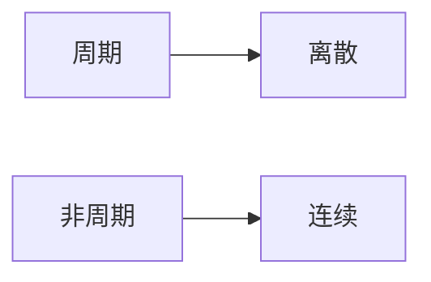

## 第一章 基础知识

### 信号、信息、数字信号处理

- 信号：反映或载有信息的物理量（光信号、电信号）

- 信息：信号的具体内容（信号代表什么意思）

> **什么是数字信号：时间和幅度均离散。**模拟信号指时间和幅度均连续。所以不是数字信号的一个信号不一定是模拟信号。

> **什么是数字信号处理：**利用计算机或专用处理设备，以数值计算的方法**对信号进**行采集、变换、综合、估值和识别等加工处理，借以达到**提取信息**和便于应用的目的。数字信号处理（按照过程来分）一般包括去噪、特征检测和应用于实际这三个方面。

## 第二章 离散时间信号

### 脉冲串序列

单位抽样信号$\delta(n)$ $\rightarrow$脉冲串序列$p(n)=\sum_{k=-\infty}^{\infty}\delta(n-k)$

### 离散信号的基本运算

- 延迟

- +、-、*（需要有相同的长度和时间范围）

- 时间尺度变换
  
  - $y(t)=x(t/2)$ : 扩展，原来的$x(1)$相当于现在的$y(2)$，相当于对原信号进行插值，采样频率变为$2f_s$
  
  - $y(t)=x(2t)$ : 压缩，原来的$x(2)$相当于现在的$y(1)$，相当于对信号进行抽取，采样频率变为$f_s/2$

- 信号的分解
  
  *信号在向量空间中向不同基向量进行投影。确定基函数+投影求系数（e.g. FFT）=信号分解*

- 信号的变换
  
  *确定基函数后求分解系数的过程（e.g. FFT、DCT）*

### 信号的分类

#### 确定信号、随机信号

graph LR;
  A[信号] --> B[确定信号];
  A --> C[随机信号];
  B --> H[周期信号];
  B --> I[非周期信号];
  C --> D[非平稳];
  C --> E[平稳];
  E --> F[各态遍历];
  E --> G[非各态遍历];

> 平稳随机信号：统计性质不随着时间改变
> 
> 遍历：随机过程的各个样本函数尽力了随机过程的各种可能状态

#### 维度区分

- 一维信号

- 二维信号

- 多通道信号
  
  *e.g. （R，G，B）*

#### 范数

$$||x||_p=\left[\int_{-\infty}^{\infty}|x|^p\right]^{1/p}$$

*每一类范数定义了一个信号空间（$l_p$）*

> 赋范线性空间：定义范数的线性空间
> 
> 线性空间：$l_\infty, l_1, l_2$都是线性空间
> 
> 度量空间：定义了距离的空间（$l_2$）
> 
> 内积空间
> 
> 希尔伯特空间：完备的内积空间

## 第三章 离散时间信号的傅里叶变换

### 傅里叶级数

傅里叶级数实际上是先找一组基向量$\{e^{-jk\Omega_0t}\}_{k=1}^{N}$，然后将信号在这组向量上投影（做内积）得到傅里叶系数，实际上傅里叶系数对应着第$k$次谐波的系数，所以一般频域时离散的，间隔为$\Omega_0$。如果要求傅里叶系数，根绝内积空间基向量的定义（正交），左右两边同时积分然后除以一个常数（基向量自己做内积得到的值）即可得到系数。

