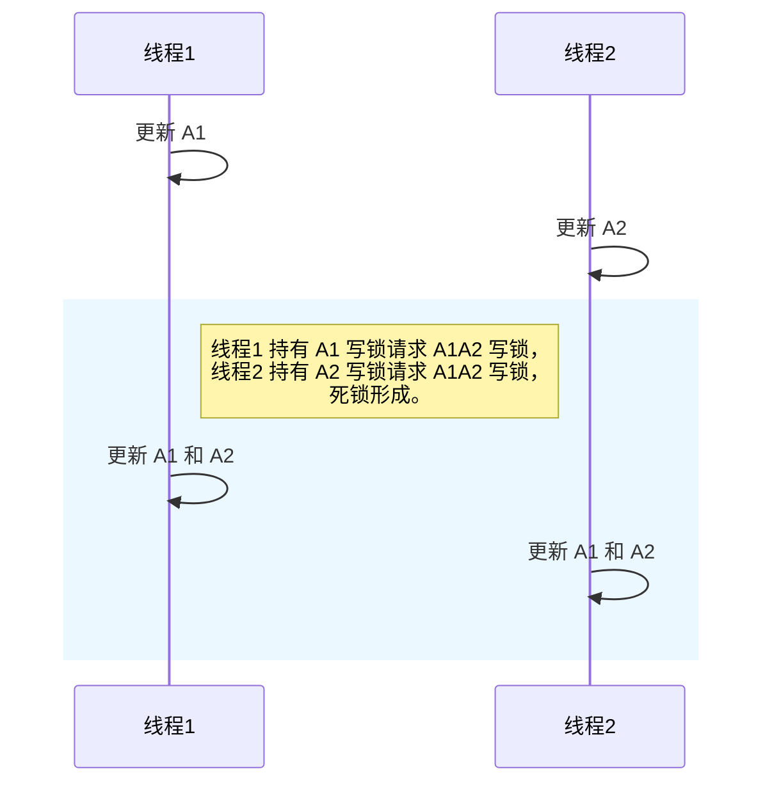

本文介绍了一个 MySQL 数据库死锁的案例和解决方案。

## 场景

生产环境出了一个偶现的数据库死锁问题，导致少部分业务处理失败。

分析特征之后，发现是多个线程并发执行同一个方法，更新关联的数据时可能会出现，把场景简化概括一下：

- 有一个数据表 tb1，主键名 id，有两条 id 分别为 A1 和 A2 的记录，对应的外键 fk_biz_no 相同；

- 方法 myFunc，整体是一个事务；

- 方法 myFunc 里的逻辑是先更新 tb1 里的一条记录，执行一些逻辑后，再更新该记录的外键对应的所有记录；

这样 线程1 和 线程2 并发执行 myFunc 方法时，示意如下：

线程1 先更新 A1，此时会对 A1 所在行加写锁，再更新 A1 和 A2，此时会同时给 A1 和 A2 所在行都加上写锁；

线程2 先更新 A2，此时会对 A2 所在行加写锁，再更新 A1 和 A2，此时会同时给 A1 和 A2 所在行都加上写锁。

如此一来，如果出现类似以下的执行时序，则会形成死锁：

带着一点伪装的 ABBA 死锁。

## 解决方案

按照消除死锁条件的思路，一般会想到将两个线程里的加锁顺序改为一致，但是此场景并不完全适用。以下是几种可行的方案：

方案一、对 myFunc 方法加分布式锁，可以用需要更新的记录的 fk_biz_no 作为锁的 key，这样同一个 fk_biz_no 的更新操作就会串行执行；

方案二、在方法/事务的最开始，就提前把 A1A2 的写锁申请到（比如 `SELECT ... FOR UPDATE`），然后再执行后续逻辑；

方案三、优化 myFunc 方法里的逻辑，先将 A1 和 A2 的数据都处理好了，然后一次性更新 A1A2，即将方法里的两次更新合并成一次更新；

方案一 和 方案二 效果类似，都是使同一 fk_biz_no 的更新操作串行了；而方法三则是消除了 ABBA 的情况（实际场景中有可能需要考虑并发执行下的数据混乱、数据覆盖的问题，那是另外的话题了，在此不展开）。

## 小结

来一起复习下死锁的四个必要条件：

- 互斥条件：一个资源每次只能被一个进程使用；

- 请求与保持条件：一个进程因请求资源而阻塞时，对已获得的资源保持不放；

- 不剥夺条件：进程已获得的资源，在末使用完之前，不能强行剥夺；

- 循环等待条件：若干进程之间形成一种头尾相接的循环等待资源关系。

预防和消除死锁的思路，则无非是消除上述四个条件中的一个或多个。
