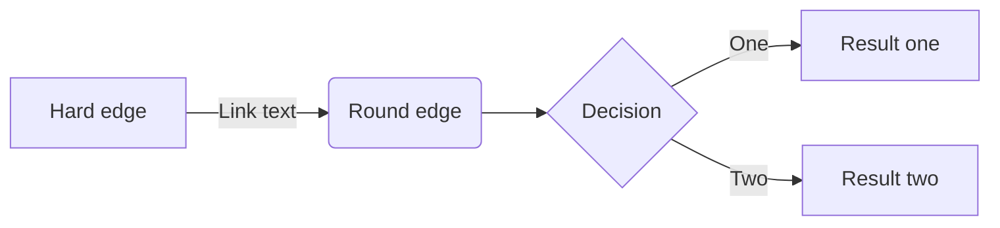

## Hello World!

### test_chapter

##### 如何发帖子？

- 首先，你需要注册一个 GitHub 账号，并创建一个仓库，仓库名为 `username.github.io`，其中 `username` 为你的 GitHub 用户名。
- 然后，在本地创建一个文件夹，并在文件夹中创建一个名为 `_posts` 的文件夹。
- 在 `_posts` 文件夹中创建一个 `.md` 文件，文件名格式为 `YYYY-MM-DD-title.md`，其中 `YYYY-MM-DD` 为发布日期，`title` 为文章标题。
- 在 `.md` 文件中，按照以下格式填写文章内容：


```python
print("Hello World!")
```
$$
\sum_{i=1}^n a_i = 0
$$

**hello**

*world*



```sequence          
A->B: Does something
B->C: Does something else
C->D: Does one last thing
``` 

```flow 
st=>start: Start
e=>end: End
op1=>operation: My Operation
sub1=>subroutine: My Subroutine
cond=>condition: Yes or No?


st->op1->cond
cond(yes)->sub1
cond(no)->op1
```

```math
\begin{align*}
\dot{x} & = \sigma(y-x) \\
\dot{y} & = \rho x - y - xz \\
\dot{z} & = -\beta z + xy
\end{align*}
```

```mindmap
* root
    * child1
    * child2
        * subchild1
        * subchild2
```

```mindmap2
* root
    * child1
    * child2
        * subchild1
        * subchild2
```

